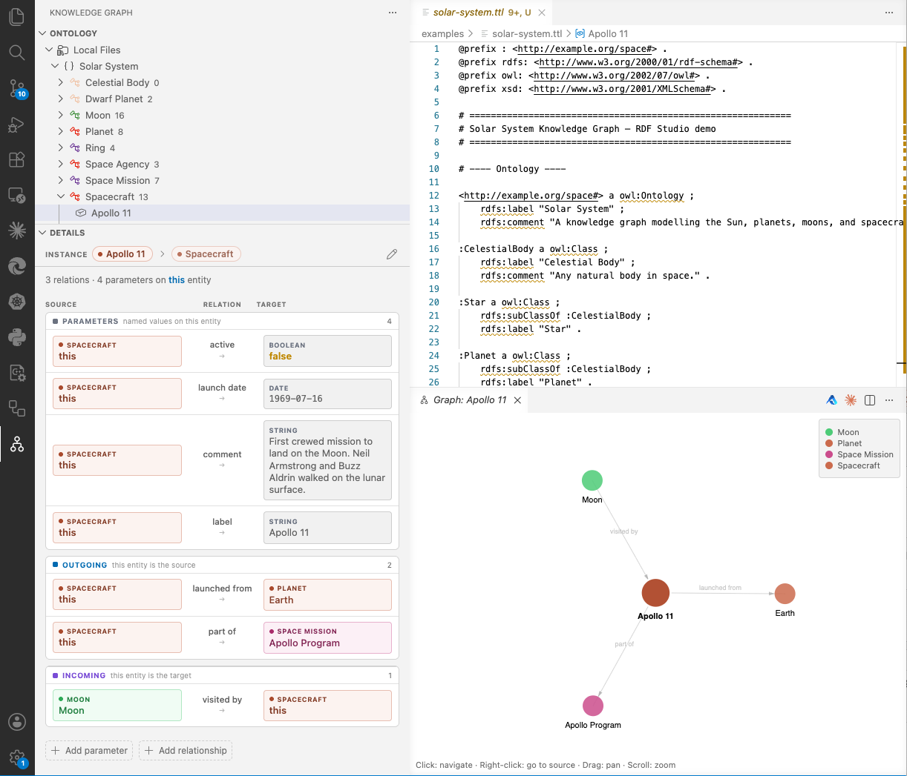

# RDF Studio

Browse, edit, and visualize RDF knowledge graphs directly in VS Code. Load Turtle (.ttl) files into an in-memory SPARQL store, connect to remote SPARQL endpoints, and explore ontologies, entities, and their relationships with a visual editor.



Built on [Oxigraph](https://github.com/oxigraph/oxigraph) WASM for full SPARQL 1.1 support — no external triplestore needed.

## Features

### Knowledge Graph Browser
- **Namespace-grouped tree** with type-colored icons showing classes, instances, and instance counts
- **Source grouping** — local files and remote SPARQL endpoints displayed separately in the tree
- **Schema view** for OWL classes showing declared and inherited properties with domain/range
- **Full superclass chain** — breadcrumb pills showing the complete class hierarchy (e.g. Fine Squad > Squad > Organization), each clickable to navigate

### Detail View
- **Instance detail** with Source, Relation, and Target columns
- **Parameters** (literal values), **Outgoing** and **Incoming** relationship sections
- **Type-colored entity boxes** — consistent HSL hue per type across tree, detail view, and graph
- **Inherited properties** — when a local class extends a remote class (via `rdfs:subClassOf`), remote properties are auto-fetched and displayed read-only with source attribution. Local data renders instantly; remote data loads in the background
- **Inline editing** — click a value to edit, Enter to save, Esc to cancel
- **Add parameter** and **Add relationship** buttons with form dialogs
- **Edit parameter** — hover to reveal pencil icon on any value

### Full CRUD
- **Create** ontologies, classes, properties, and instances via modal forms
- **Edit** labels, comments, parameters, and relationships via inline or form editing
- **Delete** with toast notification and Undo support
- **File-safe compacting** — writes only use prefixes declared in the target TTL file, preventing undeclared prefix errors
- **Auto-prefix injection** — cross-ontology references automatically add missing `@prefix` declarations

### Remote SPARQL Endpoints
- **Connect** to any SPARQL 1.1 endpoint (Apache Jena Fuseki, Virtuoso, GraphDB, Stardog, etc.)
- **Auto-discover** named graphs for endpoints that use named graph patterns
- **Lazy loading** with 5-minute TTL cache for remote instances (up to 15,000 per class)
- **Remote search** with multiple strategies — exact match, IRI construction, and text search
- **Cross-graph inheritance** — local instances automatically show properties from their remote superclass, bridging local and remote knowledge

### SPARQL & Graph Visualization
- **SPARQL query panel** with preset queries and clickable result tables
- **Neighborhood graph** — force-directed canvas visualization of an entity's direct connections
- **Type-consistent colors** — graph nodes use the same color scheme as the tree and detail views
- Click to navigate, right-click to go to source, drag to pan, scroll to zoom

### Turtle Language Support
- **Hover** — label, types, and comment on prefixed names
- **Go to Definition** (F12) — jump to where an entity is defined
- **Autocomplete** — type `:` after a prefix for resource/property completions
- **Document Outline** (Cmd+Shift+O) — all subjects in a file
- **Diagnostics** — undefined prefixes and dangling references

### Theme Support
- Full **light and dark theme** support via VS Code CSS variables
- Type-color system with curated hue overrides and automatic lightness band switching

## Getting Started

### Install from VSIX

Download the latest `.vsix` from [Releases](https://github.com/stefanavesand/rdf-studio/releases), then:

```sh
code --install-extension rdf-studio-1.0.0.vsix
```

### Build from source

```sh
git clone https://github.com/stefanavesand/rdf-studio.git
cd rdf-studio
npm install
npm run compile
npx vsce package
code --install-extension rdf-studio-1.0.0.vsix
```

Reload VS Code. The extension activates automatically when your workspace contains `.ttl` files.

### Try the example

Open the `examples/` folder to load the included Solar System knowledge graph — 8 classes, 60+ instances covering stars, planets, moons, spacecraft, and space missions.

## How It Works

On activation, the extension loads all `.ttl` files in the workspace into an in-memory Oxigraph store. All queries (tree views, detail panels, SPARQL) run as SPARQL against this store. Edits are written back to the TTL source files via VS Code's `WorkspaceEdit` API, supporting undo/redo and source control integration.

Remote SPARQL endpoints can be connected via the globe icon in the tree view header. The remote ontology is loaded on connect; remote instances are fetched on demand with caching. When a local class is a subclass of a remote class, the detail view automatically fetches inherited properties from the remote endpoint.

## Roadmap

- **SHACL validation** — constraint checking against SHACL shapes (schema service exists but is not yet wired to the UI)
- **Rename refactoring** — rename entities across all files
- **RDF/XML and JSON-LD** — additional serialization formats

## Development

```sh
npm install
npm run watch    # recompile on change
```

Press F5 in VS Code to launch an Extension Development Host.

```sh
npm test         # run mocha tests
npm run compile  # one-shot compile
npx vsce package # build .vsix
```

## License

MIT — see [LICENSE](LICENSE).
